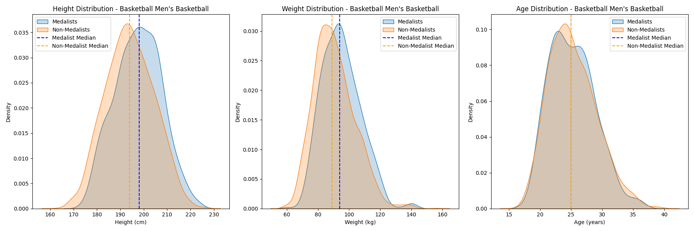

# Project of Data Visualization (COM-480)

| Student's name | SCIPER |
| -------------- | ------ |
| David Gauch | 394014 |
| Flavia Wallenhorst | 264996 |
| Arthur Wuhrmann | 344752 |

[Milestone 1](#milestone-1) • [Milestone 2](#milestone-2) • [Milestone 3](#milestone-3)

## Milestone 1 (21st March, 5pm)  

### Dataset
We aimed for an Olympic dataset found on `Kaggle`, that contains information about more than 200k athletes that participated to the Olympics, from ~1900 to 2016.This dataset includes details such as athlete names, countries, sports, events, and physical attributes (age, height, weight). Some values regarding age, height and weight are missing, but most the data is very clean.

While this dataset might limit our research, this can easily be enhanced with some side information about the countries of the athletes (their GDP, etc., for example on [this dataset](https://github.com/bnokoro/Data-Science/blob/master/countries%20of%20the%20world.csv)). We could also take into account some weather conditions (while harder for older events, this could combine the exact date of some events that could be found online and weather APIs like [OpenWeatherMap](https://openweathermap.org/history))

### Problematic
The Olympic Games bring together the world's best athletes, but what determines success at the highest level? While factors such as training, country infrastructure, and economic resources play a role, we aim to investigate whether genetic characteristics (e.g., height, weight, age) significantly influence an athlete’s chances of winning a medal. Some potential questions that we would like to be visualized throught this project are:
-  Do certain body types dominate specific sports, or can training overcome genetic limitations?
- How have elite athletes' physical traits changed over time?
- Can we estimate an athlete's medal potential based on their genetics?
- Do wealthier nations (higher GDP) outperform due to better training rather than genetic advantages?

This project targets sports analysts, data enthusiasts, and Olympic fans interested in understanding the underlying trends in athletic success

### Exploratory DA
Our preliminary analysis focuses on understanding the distribution of genetic traits (height, weight, age) and their relationship to medal achievements. For instance, in Men’s Basketball, we compared the distributions of these attributes for medalists vs. non-medalists, revealing notable differences. Here is what we found : 


The exploratory notebook (src/exploratory.ipynb) includes:

- Summary statistics of key variables.
- Initial visualizations using matplotlib and plotly.
- Data transformation steps for future interactive website integration (e.g., exporting as JSON).

Further cleaning and feature engineering may be required to refine insights.

### Related work

On `Kaggle`, where people can share their data analysis, we took some inspiration from notably [this analysis](https://www.kaggle.com/code/joshuaswords/does-hosting-the-olympics-improve-performance) that studies the effect of hosting the event for a country. 

---

**10% of the final grade**

This is a preliminary milestone to let you set up goals for your final project and assess the feasibility of your ideas.
Please, fill the following sections about your project.

*(max. 2000 characters per section)*

### Dataset

> Find a dataset (or multiple) that you will explore. Assess the quality of the data it contains and how much preprocessing / data-cleaning it will require before tackling visualization. We recommend using a standard dataset as this course is not about scraping nor data processing.
>
> Hint: some good pointers for finding quality publicly available datasets ([Google dataset search](https://datasetsearch.research.google.com/), [Kaggle](https://www.kaggle.com/datasets), [OpenSwissData](https://opendata.swiss/en/), [SNAP](https://snap.stanford.edu/data/) and [FiveThirtyEight](https://data.fivethirtyeight.com/)), you could use also the DataSets proposed by the ENAC (see the Announcements section on Zulip).

### Problematic

> Frame the general topic of your visualization and the main axis that you want to develop.
> - What am I trying to show with my visualization?
> - Think of an overview for the project, your motivation, and the target audience.

### Exploratory Data Analysis

> Pre-processing of the data set you chose
> - Show some basic statistics and get insights about the data

### Related work

> - What others have already done with the data?
> - Why is your approach original?
> - What source of inspiration do you take? Visualizations that you found on other websites or magazines (might be unrelated to your data).
> - In case you are using a dataset that you have already explored in another context (ML or ADA course, semester project...), you are required to share the report of that work to outline the differences with the submission for this class.

## Milestone 2 (18th April, 5pm)

The text is in [Milestone_2.pdf](Milestone_2.pdf). The skeletton on the website has been done using `svelte`, and can be seen in `site/`. For this first version, the values were auto-generated and do not correspond to the one in the analysis. The goal was to establish the baseline of the visualization. Moreover, some animation are planned but will be implemented later on.

### Run the website : 

```
cd site
npm install
npm run dev
```

## Milestone 3 (30th May, 5pm)

**80% of the final grade**


## Late policy

- < 24h: 80% of the grade for the milestone
- < 48h: 70% of the grade for the milestone

